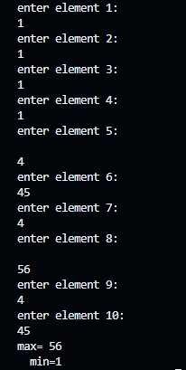

# Introduction

This repository contains a collection of basic C++ programs that demonstrate the use of arrays. The programs are written in C++ and have only been tested on Windows.

The programs cover a variety of topics, including:

* Creating and printing arrays 

* Accessing elements of arrays to find the maximum and minimum integer

* Linear searching in arrays

* Finding peak values in arrays

* Modifying arrays to store zeroes at end of the array

* To find peak values in a array

The programs are well-commented and easy to understand. They can be used as a learning resource for students and programmers who are interested in learning about arrays in C++.

## How to use

To run the programs, you will need to have a C++ compiler installed on your computer. You can then open the programs in a C++ IDE, such as Visual Studio Code.

The level of difficulty of the programs is basic. They are suitable for people who are new to C++ or arrays.

## Program wise explanation

#### 1] Creating and printing arrays :

  This code is a simple C++ program that demonstrates how to read and write integers from an array. The program first declares an array of 10 integers. Then, it prompts the user to enter 10 integers. The integers  entered by the user are stored in the array. Finally, the code prints the 10 integers stored in the array.
  
  The code is divided into three main parts:
  
  Declaring the array
  The first line of code, int arr[10];, declares an array of 10 integers. The int keyword tells the compiler that the array will store integers. The [10] after the int keyword specifies that the array will have 10 elements.
  
  Prompting the user to enter integers
  The next loop, for (int i = 0; i < 10; i++), loops 10 times. Inside the loop, the cout object is used to prompt the user to enter an integer. The cin object is then used to read the integer from the user and store it in the array at index i.
  
  The code is a simple example of how to read and write integers from an array. It can be modified to read and write other types of data, such as strings or floats. It can also be modified to perform more complex operations on the data stored in the array.
  the output for the code is shown below:

  

 

#### 2] Accessing elements of arrays to find the maximum and minimum integer

This code reads 10 integers from the user and prints the maximum and minimum values. It first declares an array of 10 integers. Then, it prompts the user to enter 10 integers. The integers entered by the user are stored in the array.

Next, the code declares two variables, max and min, to store the maximum and minimum values of the array, respectively. The max variable is initialized to the first element of the array, and the min variable is also initialized to the first element of the array.

The code then iterates over the array, comparing each element to the max and min variables. If the current element is greater than the max variable, the max variable is updated to the current element. If the current element is less than the min variable, the min variable is updated to the current element.

After the loop is finished, the code prints the max and min variables.

In other words, the code first reads 10 integers from the user. Then, it finds the largest and smallest of the 10 integers and prints them out.

the output of the code can be shown below:

  

 

#### 3]  Linear searching in arrays

  

 

